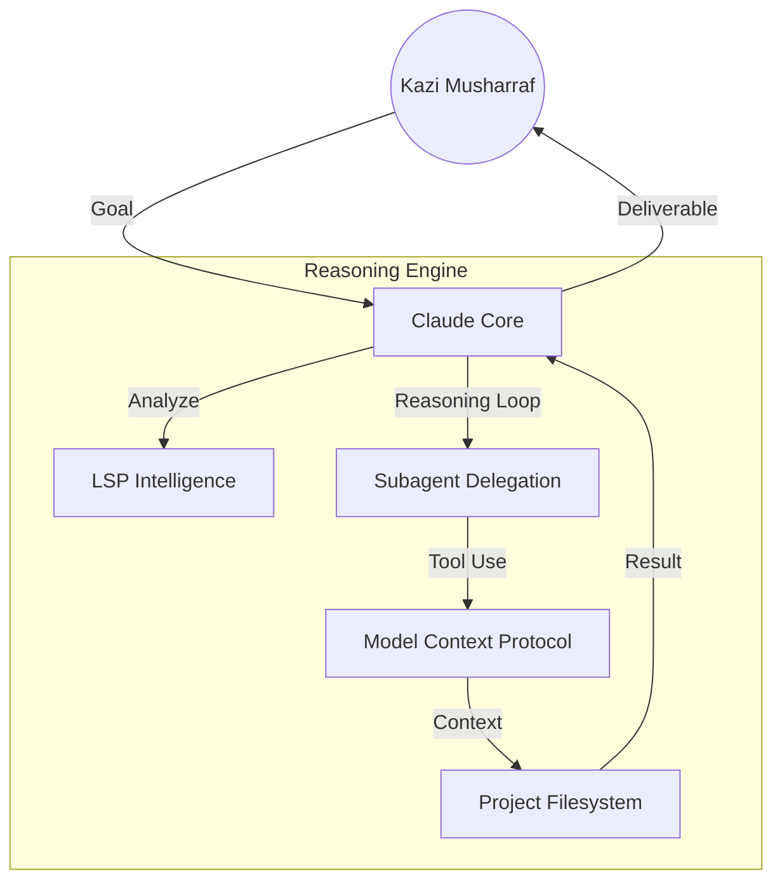

# 🟠 AI-ASSISTANT-CLAUDE


> **"The terminal is now an autonomous software factory."**

This repository is a production-grade implementation of the **Claude Code** ecosystem. It provides the scripts, skills, and configuration necessary to turn Anthropic's CLI into a high-speed, autonomous engineering partner.

---

## 🏛️ Reasoning Architecture



---

## 💎 Core Research & Features

Based on the official May 2025 General Availability specifications:

| Feature | Category | Description |
| :--- | :--- | :--- |
| **Subagent Delegation** | Intelligence | Claude can spawn specialized sub-agents to handle isolated tasks (e.g., testing, migration) in parallel. |
| **MCP Integration** | Protocol | Model Context Protocol serves as the universal adapter for GitHub, Linear, Slack, and Google Drive. |
| **LSP Intelligence** | Context | Native support for Language Server Protocol (LSP) providing IDE-grade code understanding. |
| **Reasoning Loops** | Workflow | Multi-turn reasoning threads that self-correct and iterate until parity is achieved. |
| **Extended Thinking** | Capacity | Dedicated 32k token reasoning space for cold-start architectural planning. |

---

## 📅 Historical Timeline

- **Nov 25, 2024**: Anthropic introduces the open-source **Model Context Protocol (MCP)**.
- **Feb 24, 2025**: **Claude Code** research preview launches, bringing agentic CLI to developers.
- **May 2025**: **General Availability** milestone. Introduction of subagent delegation and enhanced Multi-Agent Context.

---

## 🚀 Strategic Workflows

### 1. The Autonomous "Subagent" Orchestration
Leveraging Claude's manager-level intelligence to dispatch mechanical tasks.
1. **Decomposition**: Claude breaks a high-level goal into atomic engineering steps.
2. **Delegation**: Mechanical subagents (like Opencode) are dispatched for raw execution via the `claude-teams` MCP server.
3. **Synthesis**: Claude reviews the subagent outputs and merges them into the final PR.

### 2. Protocol-Driven Discovery
Using MCP to bridge the gap between documentation and implementation.
- **Search**: Scrape official APIs via the `firecrawl` MCP server.
- **Verify**: Audit local implementation against the scraped documentation artifacts.

---

## 🛠️ Configuration & Performance

Fine-tune your Reasoning Hub in `configs/claude-settings.json`:
```json
{
  "alwaysThinkingEnabled": true,
  "maxThinkingTokens": 32000,
  "mcpServers": {
    "filesystem": { "enabled": true },
    "github": { "enabled": true },
    "claude-teams": { "enabled": true }
  }
}
```

---

## 📂 Repository Structure

- [**agents/**](file:///Users/mkazi/ALL-REPO/4-AI-ASSISTANT/AI-ASSISTANT-CLAUDE/agents) — 40+ specialized agentic profiles (TikTok, Finance, UX, API).
- [**skills/**](file:///Users/mkazi/ALL-REPO/4-AI-ASSISTANT/AI-ASSISTANT-CLAUDE/skills) — Custom `/` commands for common workflows (Hooks, Plan Mode, MCP).
- [**workflows/**](file:///Users/mkazi/ALL-REPO/4-AI-ASSISTANT/AI-ASSISTANT-CLAUDE/workflows) — Markdown-based playbooks for standardized delivery.
- [**configs/**](file:///Users/mkazi/ALL-REPO/4-AI-ASSISTANT/AI-ASSISTANT-CLAUDE/configs) — JSON templates for MCP servers and Hooks.

---

## 🎯 Strategic Workflows

### 1. The "Think-First" Refactor
Utilizes **Extended Thinking** to map out complex dependency trees before writing a single line of code.
- **Trigger**: `/plan-mode`
- **Verification**: Automatic unit test generation after every tool use via `PostToolUse` hooks.

### 2. Multi-Agent Orchestration
Standardizes how you bridge between **Claude** (Planning) and **Opencode** (Execution/Refactoring).
- Define the blueprint in `CLAUDE.md`.
- Dispatch sub-tasks to `claude-teams`.

### 3. Integrated Security Hooks
Every tool use is intercepted by a Gitleaks-backed `PreToolUse` hook to prevent accidental secret leaks.

---

## 🛠️ Configuration

Edit [**configs/claude-settings.json**](file:///Users/mkazi/ALL-REPO/4-AI-ASSISTANT/AI-ASSISTANT-CLAUDE/configs/claude-settings.json) to fine-tune your agent's behavior:
```json
{
  "alwaysThinkingEnabled": true,
  "maxThinkingTokens": 32000,
  "theme": "dark-premium"
}
```

---

## 📜 Resources
- [Official Anthropic Docs](https://docs.anthropic.com/claude/docs/claude-code)
- [MCP Server Directory](https://github.com/modelcontextprotocol/servers)
- [Claude Teams Guide](docs/WORKFLOWS.md)

---
*Maintained by the mk-knight23 collective. Last updated: April 2026.*

---

## Key Features

### 🤖 Agent Mode
Claude Code runs autonomous multi-step tasks. Give it a goal, and it plans, executes, verifies, and corrects without constant supervision.

```bash
claude "implement user authentication with JWT tokens, add tests, and update the README"
```

### 🔧 Hooks System
Automate lifecycle events:
- `PreToolUse` — validate before any tool executes
- `PostToolUse` — auto-format, lint, or notify after
- `Stop` — final checks when session ends
- `Notification` — alerts on important events

### 🎯 Skills (Slash Commands)
Invoke reusable workflows with `/skill-name`:
```bash
/commit          # Smart conventional commit
/review-pr       # Full PR review with multiple agents
/ui-ux-pro-max   # Generate design systems
/octo            # Smart task router
/tdd             # Test-driven development
```

### 🔌 MCP Servers
Connect external tools — filesystem, GitHub, Gmail, Linear, Slack, Playwright, and more.

### 📋 CLAUDE.md
Project instructions that Claude always reads:
```markdown
# My Project
- Always use TypeScript strict mode
- Run tests before committing
- Use conventional commits format
```

### 🧠 Extended Thinking
Reserve up to 31,999 tokens for deep reasoning. Toggle with `Option+T` or set `alwaysThinkingEnabled` in settings.

### 🌐 Multi-Agent Orchestration
Spawn parallel sub-agents for independent tasks:
```javascript
// claude-teams MCP — spawn 3 agents simultaneously
await spawnTeammate({ task: "security audit" });
await spawnTeammate({ task: "performance review" });
await spawnTeammate({ task: "test coverage" });
```

---

## How I Use It Personally

### Daily Workflow
```bash
# Morning: plan the day
claude "review yesterday's commits and suggest today's priorities"

# Feature work: TDD approach
claude "implement /feature-name using TDD - write tests first"

# Code review before push
/review-pr

# Smart commit
/commit
```

### My Setup
- **Model**: claude-sonnet-4-6 for execution, claude-opus-4-6 for architecture
- **Hooks**: Auto-format (Prettier/Black) on PostToolUse
- **Skills**: 50+ custom skills in `~/.claude/skills/`
- **MCP**: GitHub, Linear, Gmail, Filesystem, Playwright all connected
- **Memory**: Project-specific context stored in memory files

### My CLAUDE.md Template
See `examples/CLAUDE.md` for the template I use on every project.

---

## Quick Start

### Installation
```bash
# Install Claude Code
npm install -g @anthropic-ai/claude-code

# Verify
claude --version

# Set API key
export ANTHROPIC_API_KEY="your-key-here"
# Or add to ~/.zshrc / ~/.bashrc
```

### First Project Setup
```bash
# Navigate to your project
cd my-project

# Initialize with CLAUDE.md
claude "create a CLAUDE.md for this project based on the existing codebase"

# Start a task
claude "add input validation to the login form"
```

### Key Commands
```bash
claude                    # Interactive mode
claude "task"             # Single task
claude --model opus       # Use Opus model
claude --dangerously-skip-permissions  # Skip confirmations (caution!)
/help                     # Show available slash commands
/clear                    # Clear conversation
/compact                  # Compress history
/cost                     # Show token usage
```

---

## Project Structure

```
AI-ASSISTANT-CLAUDE/
├── README.md                    # This file
├── index.html                   # Project website
├── docs/
│   ├── FEATURES.md              # Exhaustive feature list
│   ├── GETTING_STARTED.md       # Setup guide
│   ├── WORKFLOWS.md             # Real workflows
│   ├── SKILLS_GUIDE.md          # Skills system deep-dive
│   ├── MCP_SERVERS.md           # MCP integration guide
│   └── HOOKS.md                 # Hooks system guide
├── scripts/
│   ├── setup.sh                 # Full setup script
│   ├── claude-workflow.sh       # Productivity helpers
│   └── create-claude-md.sh      # CLAUDE.md generator
├── workflows/
│   ├── feature-dev.md           # Feature development
│   ├── daily-standup.md         # Daily workflow
│   └── code-review.md           # Code review
├── agents/
│   ├── planner.md               # Planning agent
│   └── code-reviewer.md         # Review agent
├── skills/
│   └── custom-skill-template.md # Skill template
├── examples/
│   ├── CLAUDE.md                # Example project instructions
│   └── hooks-example.json       # Hooks configuration
└── configs/
    ├── .gitignore
    └── mcp-example.json         # MCP configuration
```

---

## Skills & Agents

### Available Skills (from ~/.claude/skills/)
| Skill | Command | Description |
|-------|---------|-------------|
| UI/UX Pro Max | `/ui-ux-pro-max` | Design systems, 50+ styles, 97 color palettes |
| Octo Router | `/octo` | Smart task routing to best agent |
| Commit | `/commit` | Conventional commits with analysis |
| PR Review | `/review-pr` | Multi-agent PR review |
| TDD | `/tdd` | Test-driven development workflow |
| Claude API | `/claude-api` | Build apps with Anthropic SDK |

### Agents (from ~/.claude/agents/)
- `ai-engineer.md` — LLM app development
- `code-reviewer.md` — Security & quality review
- `frontend-developer.md` — React/UI development
- `backend-architect.md` — API & system design
- `tdd-guide.md` — Test-driven workflow
- `security-reviewer.md` — Security analysis
- 40+ more agents configured

---

## MCP Servers

Connected MCP servers in my setup:
```json
{
  "filesystem": "Read/write files beyond project",
  "github": "Issues, PRs, repos",
  "gmail": "Read/compose emails",
  "linear": "Issues & projects",
  "playwright": "Browser automation",
  "claude-teams": "Multi-agent orchestration",
  "firecrawl": "Web scraping",
  "memory": "Knowledge graph"
}
```

See `docs/MCP_SERVERS.md` for full configuration guide.

---

## Hooks System

Example hooks config (`~/.claude/settings.json`):
```json
{
  "hooks": {
    "PostToolUse": [
      {
        "matcher": "Write|Edit",
        "hooks": [{
          "type": "command",
          "command": "prettier --write $CLAUDE_TOOL_OUTPUT_FILE 2>/dev/null || true"
        }]
      }
    ],
    "Stop": [{
      "type": "command",
      "command": "~/.claude/scripts/session-summary.sh"
    }]
  }
}
```

See `docs/HOOKS.md` for full hooks documentation.

---

## Workflows

| Workflow | File | Description |
|----------|------|-------------|
| Feature Dev | `workflows/feature-dev.md` | Plan → TDD → Implement → Review → Commit |
| Daily Standup | `workflows/daily-standup.md` | Morning review + priority setting |
| Code Review | `workflows/code-review.md` | Multi-agent review before PR |

---

## Scripts

| Script | Description |
|--------|-------------|
| `scripts/setup.sh` | Full environment setup |
| `scripts/claude-workflow.sh` | Productivity helper functions |
| `scripts/create-claude-md.sh` | Auto-generate CLAUDE.md |

---

## Resources

- [Official Docs](https://docs.anthropic.com/claude-code)
- [GitHub](https://github.com/anthropics/claude-code)
- [Skills Marketplace](https://skills.anthropic.com)
- [MCP Registry](https://github.com/anthropics/mcp-servers)

---

*Built and maintained with Claude Code itself. Star the repo if it helped!*

## Security

This project follows security best practices:
- No hardcoded credentials
- Dependency scanning enabled
- Security headers configured
- Regular security audits performed
